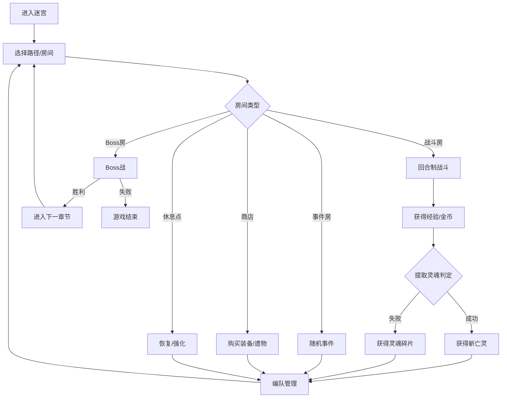

# 游戏概述

## 项目名称
**Summon Maze（召唤迷宫）**

## 游戏类型
- **核心类型**：Roguelike 地牢探索 + 怪物收集养成
- **战斗类型**：回合制策略战斗（位置制）
- **视角**：2.5D 等距视角 / 侧面视角
- **平台**：PC（首发）/ 后续考虑 Switch、移动端

## 游戏标签
`Roguelike` `怪物收集` `回合制策略` `地牢探索` `暗黑奇幻` `亡灵召唤` `卡牌构筑（轻量）`

## 核心玩法概括
玩家扮演一名**死灵召唤师**，进入随机生成的迷宫进行探索。在迷宫中，玩家将与各种怪物战斗，击败怪物后有概率通过 **"提取灵魂"** 能力将其转化为自己的**亡灵队友**。亡灵队友和主人公一样拥有独立行动回合与独立技能。玩家需要在战斗间分配属性点、选择出战亡灵、调整站位，并在 3 个章节中击败每章 Boss。

## 核心循环

## 核心特色

### 1. 亡灵军团系统
- 击败的怪物有概率成为队友
- 备战槽位最高 8，但每场战斗最多同时出战 3 个亡灵
- 亡灵保留其生前的技能和特性，并拥有独立行动回合
- 亡灵之间的**协同效果**（同种族、同元素等加成）

### 2. 双重成长线
- **主人公成长**：等级、属性、技能树、装备
- **亡灵成长**：等级、进化、技能解锁、忠诚度

### 3. 策略性位置战斗
- 使用 1-4 号位站位系统，行动顺序从左到右
- 不同技能有位置要求（施放位置 + 目标位置）
- 需要根据亡灵特性安排阵型

### 4. Roguelike 地图探索
- 当前版本为 3 层短流程，每层随机生成 6-8 个节点
- 多条路径选择，资源与风险的权衡
- 路线中可能遇到精英小 Boss，参考《杀戮尖塔》的精英路线选择
- 永久死亡（单局内亡灵死亡不可复活）

## 参考作品

| 作品 | 参考要素 |
|------|----------|
| 《我独自升级》 | 主人公设定、提取灵魂、亡灵军团概念 |
| 《暗黑地牢》 | 位置制战斗、压力/状态系统、暗黑氛围 |
| 《杀戮尖塔》 | 地图节点选择、遗物系统、卡牌构筑思路 |
| 《魔法门：上古纪元》 | 回合制战斗节奏、队伍管理 |
| 《宝可梦》系列 | 怪物收集与进化、属性克制 |
| 《Hades》 | Roguelike 叙事节奏、房间奖励选择 |

## 目标受众
- 喜欢 Roguelike 和策略游戏的玩家
- 《我独自升级》粉丝
- 怪物收集/养成爱好者
- 喜欢暗黑奇幻美术风格的玩家
- 预估游戏时长：单局 25-45 分钟，先以较小内容量验证核心循环

## 情感体验目标
- **权力感**：从孤身一人到率领亡灵军团的成长体验
- **策略感**：精心搭配亡灵阵容后的战斗成就感
- **紧张感**：永久死亡机制带来的决策压力
- **惊喜感**：成功提取稀有怪物的兴奋
- **沉浸感**：暗黑奇幻世界的氛围营造
